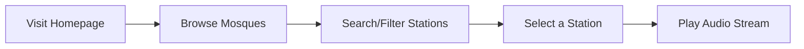
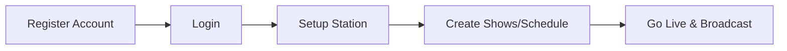
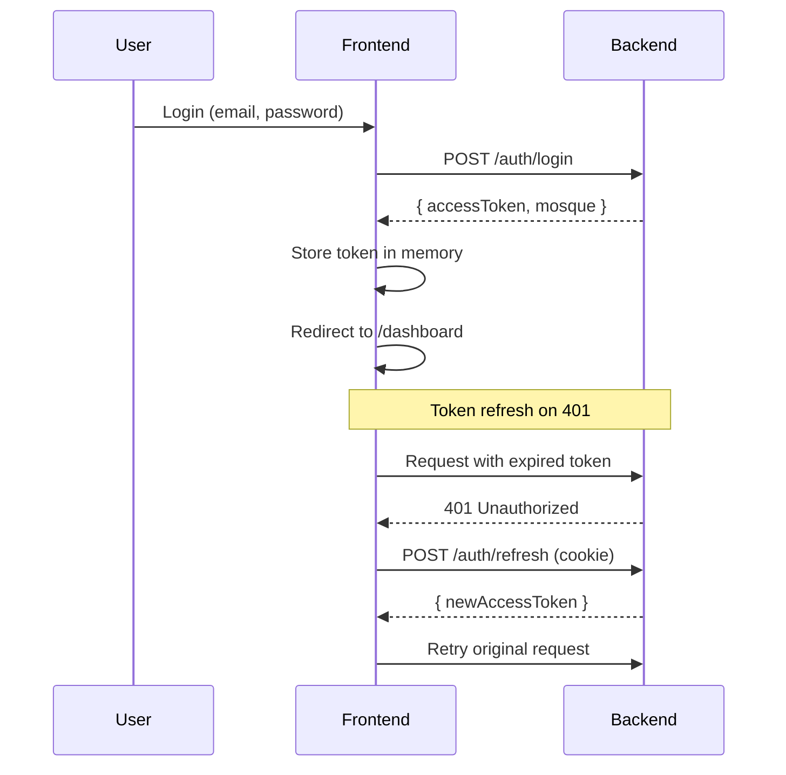

# Minaret - How The App Works

A mosque live audio streaming platform built with React, TypeScript, and Vite.

---

## 📖 Overview

**Minaret** allows mosques to broadcast live audio streams (lectures, prayers, etc.) to listeners worldwide. Think of it as a radio station platform specifically for mosques.

---

## 🔄 Application Flow

### 1. Public User Flow (Listening)



**Pages:**

- `/` - Homepage with featured stations
- `/mosques` - Browse all registered stations
- `/mosques/:id` - Individual mosque detail page with schedule and audio player

---

### 2. Mosque Owner Flow (Broadcasting)



**Pages:**

- `/register` - Create new mosque account
- `/login` - Sign in to dashboard
- `/dashboard` - Overview of station stats
- `/dashboard/station/setup` - Configure station settings
- `/dashboard/shows` - Manage broadcast schedule
- `/dashboard/shows/new` - Create new show
- `/dashboard/shows/:id/edit` - Edit existing show
- `/dashboard/broadcast` - Go live/offline, update "Now Playing"
- `/dashboard/settings` - Account & profile settings

---

## 🏗️ Architecture

### Frontend Structure

```
src/
├── pages/           # Route components
│   ├── Home.tsx
│   ├── Mosques.tsx        # Public station list
│   ├── MosqueDetail.tsx   # Public station view
│   ├── Login.tsx
│   ├── Register.tsx
│   └── dashboard/         # Protected pages
│       ├── Dashboard.tsx
│       ├── Broadcast.tsx  # Go live controls
│       ├── Shows.tsx
│       ├── ShowForm.tsx
│       ├── StationSetup.tsx
│       └── Settings.tsx
├── services/        # API layer
│   ├── api.ts             # Axios config + token refresh
│   ├── authService.ts     # Login, register, logout
│   ├── stationService.ts  # Station CRUD
│   └── showService.ts     # Show scheduling
├── hooks/           # React Query hooks
│   ├── useAuth.ts         # Auth state + mutations
│   ├── useStations.ts     # Station data fetching
│   └── useShows.ts        # Show data fetching
├── stores/          # Zustand stores
│   └── playerStore.ts     # Audio player state
├── components/      # Reusable UI
├── layouts/         # Page layouts
└── types/           # TypeScript interfaces
```

---

## 🔐 Authentication Flow



**Key features:**

- **Access token** stored in memory (not localStorage)
- **Refresh token** stored in HTTP-only cookie
- Automatic token refresh via Axios interceptors

---

## 📡 Broadcasting Flow

1. **Setup Station** → Configure name, description, bitrate, format
2. **Create Shows** → Schedule recurring broadcasts with days/times
3. **Go Live** → Click "Go Live" to start accepting stream
4. **Stream Audio** → Use external software (OBS, BUTT, etc.) to connect to mount point
5. **Update Now Playing** → Set current track info
6. **Go Offline** → End broadcast session

---

## 🔑 Key Technologies

| Layer      | Technology               |
| ---------- | ------------------------ |
| Frontend   | React 18 + TypeScript    |
| Build      | Vite                     |
| Routing    | React Router v6          |
| State      | React Query + Zustand    |
| HTTP       | Axios                    |
| Styling    | Tailwind CSS + shadcn/ui |
| Animations | Framer Motion            |
| Toasts     | Sonner                   |

---

## 🌐 API Endpoints (Backend)

### Auth

- `POST /auth/register` - Create account
- `POST /auth/login` - Get tokens
- `POST /auth/logout` - Clear session
- `POST /auth/refresh` - Refresh access token
- `GET /auth/me` - Current user info

### Stations

- `GET /stations` - List all stations
- `GET /stations/live` - List live stations only
- `GET /stations/:slug` - Station details
- `GET /stations/me` - Owner's station
- `POST /stations` - Create station
- `PATCH /stations/me` - Update station
- `POST /stations/me/go-live` - Start broadcast
- `POST /stations/me/go-offline` - End broadcast
- `PATCH /stations/me/now-playing` - Update track info

### Shows

- `GET /stations/:id/shows` - List shows
- `POST /shows` - Create show
- `PATCH /shows/:id` - Update show
- `DELETE /shows/:id` - Delete show

---

## 🖥️ Running the App

```bash
# Install dependencies
npm install

# Start development server
npm run dev

# Build for production
npm run build
```

**Environment Variables:**

```env
VITE_API_URL=http://localhost:3000/api/v1
```
